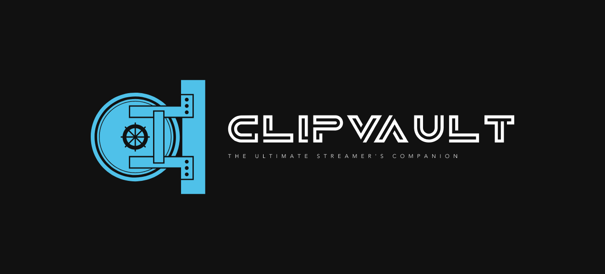

# Clips Vault

<div align="center">
  
</div>

<div align="center">
  <a href="https://www.gnu.org/licenses/gpl-3.0.en.html"></a>
  <a href="#"></a>
</div>

Clips Vault is a powerful application designed to help you sort and manage clips from all your streams. With Clips Vault, you can easily organize, categorize, and catalogue the best moments from your stream.

## Features

### 1. Tags

[]()

Tags allow you to categorize your clips based on various themes, events, or any other criteria you find relevant. Easily assign tags to your clips to create personalized collections and quickly locate specific clips whenever you want to revisit them or maybe create montages of every funny moment. 

### 2. Queue

[]()

Keep track of which clips you still need to edit. By adding clips to the queue, streamers can easily prioritize and manage their editing tasks.

### 3. Notifications

[]()

Stay informed and updated with the Notifications. Receive notifications directly from the application, keeping you in the loop about important events such as new stream additions, added clips, and deleted clips. Curerntly Discord and Gmail are the two supported platforms.

### 3. ClipIt

[]()

Send a POST request to the application, providing the clip duration and any relevant tags. The application will process the request and create a clip based on the provided parameters. Automatically create clips every time you get raided, or a gifted bomb of over 10 or when a channel point is redeemed. 

```
headers: {
    'Content-Type': 'application/json',
    'x-api-key': 'your-api-key'
},
body: {
  "length": 20,
  "tags": ["gaming", "funny", "raid"]
}
```


### 4. Favorite Clips

[]()

Mark your most memorable clips as favorites. Easily access and revisit your favorite clips whenever you want, all within the Clips Vault application.

### 6. Search Functionality


The Search Functionality in Clips Vault empowers streamers to quickly locate clips based on tags, dates, favorites, and categories. Effortlessly navigate through your clip library, create personalized collections, and compile highlight reels, enhancing the overall content management experience.

### 7. Edit Stream Details


Effortlessly customize stream categories, dates, and video categories. Optimize organization, enhance discoverability, and provide a seamless experience for viewers navigating your content.

## Getting Started

To use Clips Vault locally, follow these steps:

1. Clone the repository:

```bash
git clone https://github.com/your-username/clips-vault.git
```

2. Install the necessary dependencies:

```bash
cd clipsvault
npm install
```

3. Start the application:

```bash
npm start
```

4. Access the application in your browser at `http://localhost:3000`.

## Contributing

Contributions are welcome! If you have any ideas, bug reports, or feature requests, please submit an issue or a pull request. For major changes, kindly open an issue first to discuss the proposed changes.

Please make sure to update tests as appropriate.

## License

This project is licensed under the Creative Commons Attribution-NonCommercial (CC BY-NC) License. You are free to use, modify, and distribute this code for non-commercial purposes, as long as you provide attribution to the original creator.

## Contact

If you have any questions or need assistance, feel free to reach out to our support team at support@clipsvault.com.

Happy clipping!
